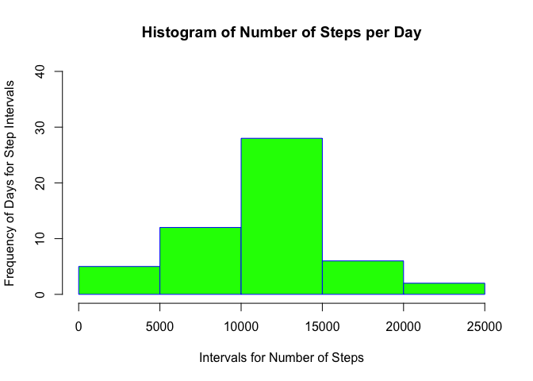
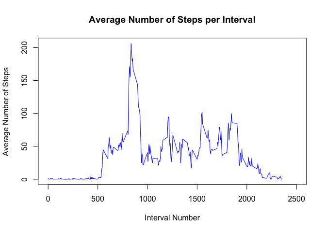
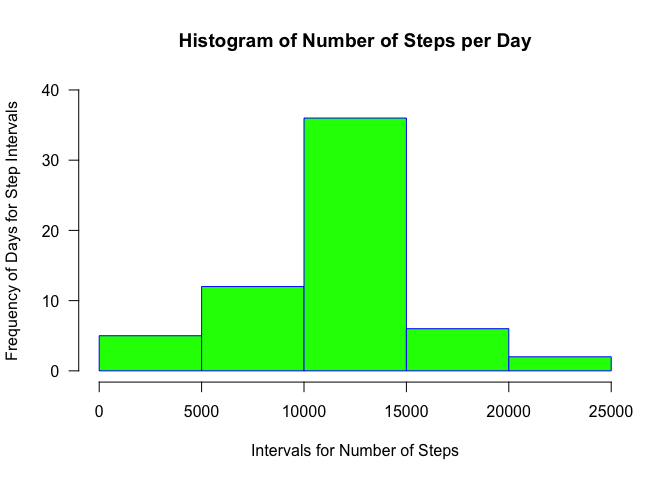
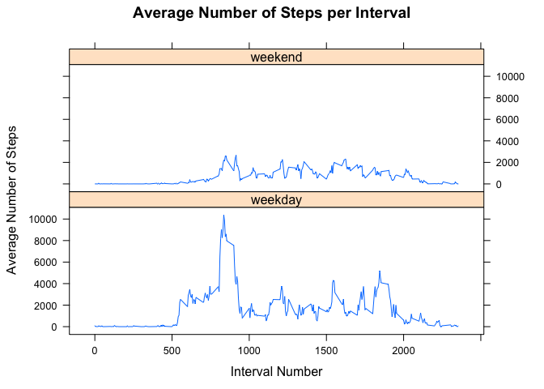

# Reproducible Research: Peer Assessment 1


*Date 12 Feb 2017*

## Introduction
This assignment makes use of data from a personal activity monitoring device. This device collects data at 5 minute intervals through out the day. The data consists of two months of data from an anonymous individual collected during the months of October and November, 2012 and include the number of steps taken in 5 minute intervals each day.

The data for this assignment (approx 52K) is available in the working directory

The variables included in this dataset are:

    steps: Number of steps taking in a 5-minute interval (missing values are coded as NA)
    date: The date on which the measurement was taken in YYYY-MM-DD format
    interval: Identifier for the 5-minute interval in which measurement was taken

The dataset is stored in a comma-separated-value (CSV) file and there are a total of 17,568 observations in this dataset.                       

## Pre-requisites
Load explicitly the dplyr and ggplot2 libraries and supress messages created during the installation

```r
suppressMessages(library(dplyr))
library("dplyr")
suppressMessages(library(ggplot2))
library("ggplot2")
```

## Loading and preprocessing the data

The activity data is read in from the csv file "activity.csv" in the working directory. The parameter "stringsAsFactors" is set to False explicitly to prevent the date character vectors being converted to factors.


```r
activity  <- read.csv("./activity.csv", stringsAsFactors = F)
```

The date charater vectors are converted to objects of class Date for convenience of manipulation later

```r
activity$date <- as.Date(activity$date)
```
A quick overview and summary of the dat is shown below
Overview

```r
glimpse(activity)
```

```
## Observations: 17,568
## Variables: 3
## $ steps    (int) NA, NA, NA, NA, NA, NA, NA, NA, NA, NA, NA, NA, NA, N...
## $ date     (date) 2012-10-01, 2012-10-01, 2012-10-01, 2012-10-01, 2012...
## $ interval (int) 0, 5, 10, 15, 20, 25, 30, 35, 40, 45, 50, 55, 100, 10...
```

Summary

```r
summary(activity)
```

```
##      steps             date               interval     
##  Min.   :  0.00   Min.   :2012-10-01   Min.   :   0.0  
##  1st Qu.:  0.00   1st Qu.:2012-10-16   1st Qu.: 588.8  
##  Median :  0.00   Median :2012-10-31   Median :1177.5  
##  Mean   : 37.38   Mean   :2012-10-31   Mean   :1177.5  
##  3rd Qu.: 12.00   3rd Qu.:2012-11-15   3rd Qu.:1766.2  
##  Max.   :806.00   Max.   :2012-11-30   Max.   :2355.0  
##  NA's   :2304
```

## What is mean total number of steps taken per day?

A summary of steps per date is calculated using the summarise funtion piped into a filter and a grouping by date funtion.
Empty number of steps values (NAs) are not included. In addition a filter for any days with a resulting step sum of zero are removed after the steps summary per day is calculated


```r
StepsPerDay <-    activity %>%
                  group_by(date) %>%
                  filter(!is.na(steps)) %>%
                  summarise(s_steps = sum(steps, na.rm=TRUE))
```

The data is plotted using a histogram (note: not a barplot). The x axis shows intervals for the number of step counts. The y axis shows the frequency of days for the different step count intervals 


```r
hist(StepsPerDay$s_steps, main = "Histogram of Number of Steps per Day", 
     breaks = 5,
     xlab = "Intervals for Number of Steps", 
     ylab = "Frequency of Days for Step Intervals",
     ylim=c(0,40),
     border="blue",
     col="green")
```



The mean of the number of steps per day is calcuated

```r
Mean <- mean(StepsPerDay$s_steps)
Mean
```

```
## [1] 10766.19
```

The median is also calculated

```r
Median <- median(StepsPerDay$s_steps)
Median
```

```
## [1] 10765
```
For reference summary statistics are also shown

```r
summary(StepsPerDay)
```

```
##       date               s_steps     
##  Min.   :2012-10-02   Min.   :   41  
##  1st Qu.:2012-10-16   1st Qu.: 8841  
##  Median :2012-10-29   Median :10765  
##  Mean   :2012-10-30   Mean   :10766  
##  3rd Qu.:2012-11-16   3rd Qu.:13294  
##  Max.   :2012-11-29   Max.   :21194
```

## What is the average daily activity pattern?

Purpose of this section is to make a time series plot (i.e. type = "l") of the 5-minute interval given in the original data set on the x-axis and the average number of steps taken, averaged across all days  on the y-axis. 
Then which 5-minute interval, on average across all the days in the dataset, that contains the maximum number of steps is determined.
Using the pipe functionality the average of the steps per interval is calculated per interval, removing steps values of zero by allowing only non zero step values into the next step of the cascaded functions in the pipe.

```r
AverageStepsPerInterval <- activity%>%
                        group_by(interval)%>%
                        filter(!is.na(steps))%>%
                        summarise(AverageSteps = mean(steps, na.rm=TRUE))
```

The time series is generated and plotted


```r
plot(AverageStepsPerInterval$interval,
     AverageStepsPerInterval$AverageSteps,
     type="l",
     xlab="Interval Number",
     ylab="Average Number of Steps",
     main="Average Number of Steps per Interval",
     col="blue",
     xlim = c(0, 2500))
```



*Which 5-minute interval, on average across all the days in the dataset, contains the maximum number of steps?*

The interval with the max value for the average number of steps per interval is calculated.

```r
MaxValueForAverageStepsPerInterval <- max(AverageStepsPerInterval$AverageSteps)
paste("Maximum value for the average number of steps per interval is ", MaxValueForAverageStepsPerInterval)
```

```
## [1] "Maximum value for the average number of steps per interval is  206.169811320755"
```
The actual interval with the max value for the average number of steps per interval in now calculated

```r
IntervalWithMax <- AverageStepsPerInterval[AverageStepsPerInterval$AverageSteps==MaxValueForAverageStepsPerInterval,1]
paste("Interval with maximum value for average number of steps / interval is ", IntervalWithMax)
```

```
## [1] "Interval with maximum value for average number of steps / interval is  835"
```


## Imputing missing values

It should be noted there are a number of days/intervals where there are missing values (coded as NA). The presence of missing days may introduce bias into some calculations or summaries of the data.

Calculate and report the total number of missing values in the dataset (i.e. the total number of rows with NAs)


```r
sum (is.na(activity))
```

```
## [1] 2304
```


*Devise a strategy for filling in all of the missing values in the dataset?*

A good estimate for a missing value for an interval number of steps is the average number of steps for that interval on different days. We have this calculated already in AverageStepsPerInterval. 
The entries with NA values (activity_NA) and non NA (activity_no_NA)  are identified in the original data. The values for step averages are then assigned to those entries with NA values. Both tables are then bound to create a new set with NA values now replaced by average interval values. Finally the data are order by column 2 (date) and 3 (internal) as per original data (activity).


```r
activity_NA <- activity[is.na(activity),]
activity_no_NA <- activity[complete.cases(activity),]
activity_NA$steps <- as.numeric(AverageStepsPerInterval$AverageSteps)
NAFilled_activity <- rbind(activity_NA,activity_no_NA)
NAFilled_activity <- NAFilled_activity[order(NAFilled_activity[,2],NAFilled_activity[,3]),]
```
Note there are now no NA values in the dataset

```r
sum (is.na(NAFilled_activity))
```

```
## [1] 0
```

We have thus created a new dataset that is equal to the original dataset but with the missing data filled in.

We can now make a histogram of the total number of steps taken each day and calculate and report the mean and median total number of steps taken per day.


```r
NAFilled_activity_Final<- NAFilled_activity%>%
                        group_by(date)%>%
                        summarise(steps = sum(steps, na.rm=TRUE))

hist(NAFilled_activity_Final$steps, 
    breaks = 5,
    main = "Histogram of Number of Steps per Day",
    xlab = "Intervals for Number of Steps",
    ylab = "Frequency of Days for Step Intervals",
    border = "blue",
    col = "green",
    las = 1,
    ylim = c(0, 40))
```


The mean of the number of steps per day is calcuated

```r
Mean <- mean(NAFilled_activity_Final$steps)
Mean
```

```
## [1] 10766.19
```

The median is also calculated

```r
Median <- median(NAFilled_activity_Final$steps)
Median
```

```
## [1] 10766.19
```
*Do these values differ from the estimates from the first part of the assignment?* Yes. The mean and median are now the same as the mean for the original data set (activity)

*What is the impact of imputing missing data on the estimates of the total daily number of steps?*

The max value of y axis, number/frequency of days for a given interval of has increased. For the interval 10,000 to 15,000 the max has increassed to between 30 and 40 compared to between 25 and 30 before the values were inserted. The distribution is in this way sharpened.


## Are there differences in activity patterns between weekdays and weekends?

For this part the weekdays() function may be of some help here. We will use the dataset with the filled-in missing values for this part.

We will create a new factor variable in the dataset with two levels ??? ???weekday??? and ???weekend??? indicating whether a given date 
is a weekday or weekend day using the weekdays function.
    
We will then make a panel plot containing a time series plot (i.e. type = "l") of the 5-minute interval (x-axis) and 
the average number of steps taken, averaged across all weekday days or weekend days (y-axis).


```r
NAFilled_activity$dayType <- ifelse(weekdays(NAFilled_activity$date) %in% c("Saturday", "Sunday"), "weekend", "weekday")
NAFilled_activity$dayType <- as.factor(NAFilled_activity$dayType)
library("lattice")

plot_data <- NAFilled_activity %>%
      group_by(dayType, interval) %>%
      summarise(steps_per_day = sum(steps))

with (plot_data,
      xyplot(steps_per_day ~ interval | dayType,
            type = "l",
            layout = c(1,2),
            xlab="Interval Number",
            ylab="Average Number of Steps",
            main="Average Number of Steps per Interval"))
```



There are activity differences. The activity during the week is higher than during the weekend


